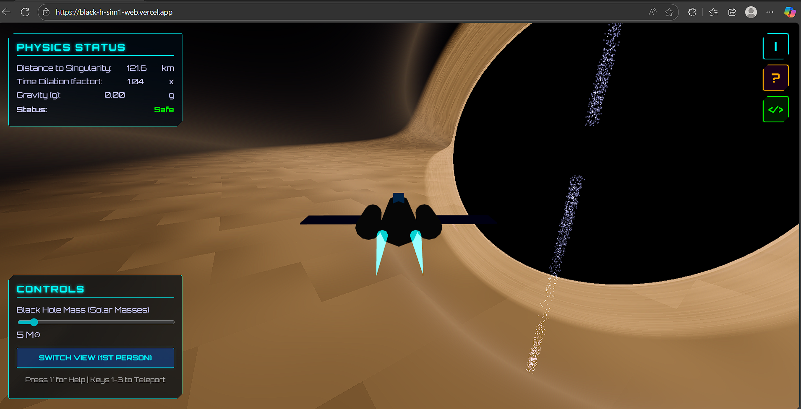
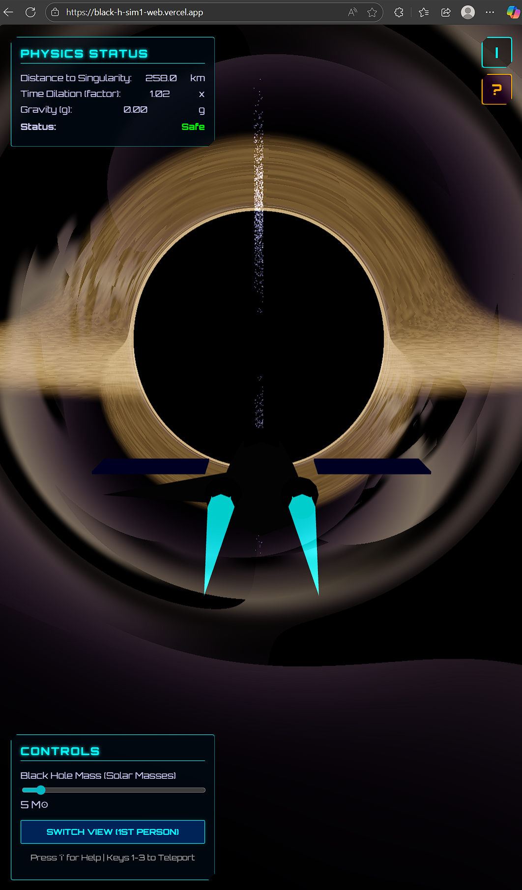

<h1 align="center">🌌 BLACK HOLE SIMULATION </h1>

<p align="center">
  <strong>🚀 Experience the Edge of Spacetime 🚀</strong>
</p>

<p align="center">
  <em>A scientifically-inspired, immersive 3D journey into the heart of a supermassive black hole.<br/>
  Built with Three.js • Powered by real physics • Ready for your exploration.</em>
</p>

<p align="center">
  <a href="https://black-h-sim1-web.vercel.app">
    
  </a>
</p>

---

## 📸 Screenshots

<table align="center">
  <tr>
    <td></td>
    <td></td>
  </tr>
</table>

---

## 🎯 Mission Briefing

> **COMMANDER, YOUR MISSION AWAITS.**
>
> You have been selected for humanity's most daring expedition — a journey to the edge of a supermassive black hole designated **VOID-X1**. Your objective: study the effects of extreme gravity, gravitational lensing, and time dilation. Survive the mission. Return with data.
>
> *The Event Horizon awaits. Will you cross it?*

---

## ✨ Features

### 🔬 **Realistic Physics Simulation**

| Feature | Description |
|---------|-------------|
| ⚫ **Gravitational Lensing** | Real-time raymarching shaders distort light around the black hole |
| 🌀 **Accretion Disk** | Volumetric, glowing matter swirling at relativistic speeds |
| ⚡ **Relativistic Jets** | High-energy particle ejections from the poles |
| ⏱️ **Time Dilation** | Experience how time slows as you approach the event horizon |
| 🍝 **Spaghettification** | Visual and UI warnings as tidal forces intensify |
| 🔴 **Gravitational Redshift** | Color shifting and visual warping near the singularity |

### 🛸 **Spaceship Experience**

| Feature | Description |
|---------|-------------|
| 🚀 **Procedural Ship** | Fully 3D-modeled spacecraft with thruster effects |
| 👁️ **Dual Camera Modes** | Switch between cockpit (1st person) and orbit (3rd person) views |
| 🎛️ **Interactive HUD** | Real-time physics data and proximity warnings |

---

## 🎮 Controls

### ⌨️ Movement

| Key | Action |
|-----|--------|
| `W` | 🔼 Thrust Forward |
| `S` | 🔽 Thrust Backward |
| `A` | ◀️ Strafe Left |
| `D` | ▶️ Strafe Right |
| `SPACE` | ⬆️ Ascend |
| `SHIFT` | ⬇️ Descend |
| `MOUSE` | 🎯 Aim / Look Around |

### 🎯 Quick Actions

| Key | Action |
|-----|--------|
| `1` | 🛰️ Teleport to **Safe Orbit** |
| `2` | 🌀 Teleport to **Accretion Disk** |
| `3` | ⚡ Teleport to **Relativistic Jets** |
| `ESC` | ⏸️ Release Cursor / Pause |

---

## 🛠️ Run Locally

```bash
# Clone the repository
git clone https://github.com/NITRR-Vivek/black_h_sim1_web.git

# Navigate to project directory
cd black_h_sim1_web

# Install dependencies
npm install

# Launch development server
npm start
```
